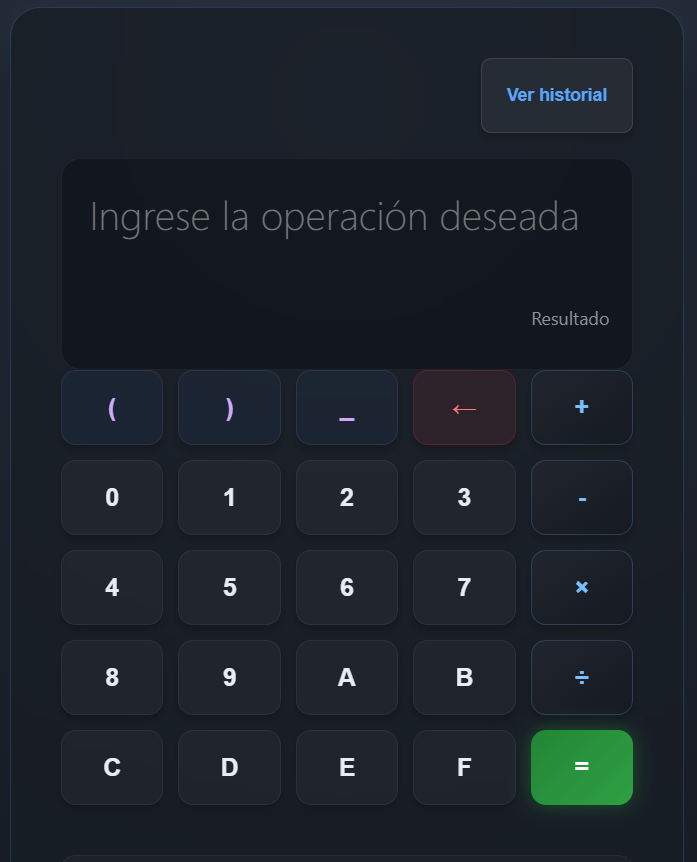

# Calculadora Multibase Desktop App

## Descripción
Calculadora de escritorio con Electron y JavaScript para operaciones y conversiones entre bases numéricas.

## Objetivo
Practicar desarrollo desktop con tecnologías web separando proceso principal, renderizador y lógica matemática.

## Tecnologías utilizadas
- Electron
- JavaScript
- HTML
- CSS
- Node.js

## Funcionalidades principales
- Interfaz desktop
- Lógica en math_core.js
- Worker de cálculo
- Proceso main y renderer

## Mi rol
Implementé estructura Electron, interfaz y lógica de conversión/cálculo.

## Aprendizajes clave
- Procesos Electron
- UI/lógica
- JavaScript desktop
- Interfaces utilitarias

## Instalación y ejecución
```bash
cd CalculadoraMultibase-DesktopApp/src
npm install
npm start
```

## Estructura del proyecto
- src/main.js: proceso principal
- src/renderer.js: UI
- src/math_core.js y calc_worker.js: cálculos
- src/Calculadora.html/css: vista

## Capturas o demo


## Estado del proyecto
Proyecto académico funcional.

## Valor técnico demostrado
Muestra construccion desktop con stack web y responsabilidades separadas.

## Mejoras futuras
- Agregar pruebas
- Empaquetar instalador
- Documentar limites de entrada

## Autor
Geovanni González  
Estudiante de Ingeniería en Computación  
GitHub: [Geovanni-Gonzalez](https://github.com/Geovanni-Gonzalez)


